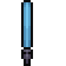

<h1 align="left">Hello There!!I am Gabriel Nasol </h1>

<h3 align="left">Welcome to my GitHub profile, where I combine passion for technology with a focus on continuous improvement.</h3>

  

  

<h3 align="left">🚀 Languages and Tools I Use:</h3>

  
  
  
  
  
  
  
  
  
  
  
  
  

<h3 align="left">Connect with me:</h3>

