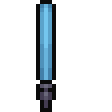

<h1 align="center">
  Hello There!!
  
  I'm Gabriel Nasol
</h1>

  
  &nbsp;
  

  <em>
    Currently building solutions in the industry as a <b>Software Developer</b>, while still aspiring to become a <b>Software Engineer</b> and <b>Entrepreneur</b>. 
    Passionate about creating impactful, scalable technology and committed to continuous growth through real-world projects, innovation, and collaborative development. 
    A <b>Magna Cum Laude Computer Science graduate</b> from
    <a href="https://www.facebook.com/LSPULBCOfficial"><b>Laguna State Polytechnic University – Los Baños</b></a> <b>(Batch 2025)</b>.
  </em>

<h2 align="center">🧑‍💻 About Me</h2>

- 🤖 &nbsp;Specializes in **Machine Learning** and **Data Analysis**
- 👨🏻‍💻 &nbsp;Currently learning **ReactJS**, **PyTorch**, **.NET** & **NodeJS**
- 📈 &nbsp;Exploring **AI**, **Software Development**, **Financial Planning** & **Investing**
- 🛡️ &nbsp;Open to learn more about **Cyber Security**
- 🎮 &nbsp;Love video games, puzzles, and brain twisters
- 💪🏻 &nbsp;Fitness enthusiast — always up for the **Gym & Running**
- 🤝 &nbsp;Quiet at first, but love making friends and hanging out

 

  
  &nbsp;<em><b>"The more I read, the more I acquire, the more certain I am that I know nothing."</b></em>
  &nbsp;— <em>Voltaire</em>&nbsp;
  

<h2 align="center">🛠️ Languages &amp; Tools</h2>

  

<h2 align="center">🌐 Connect With Me</h2>

  
  &nbsp;
  
  &nbsp;
  
  &nbsp;
  

⭐ From <a href="https://github.com/nasolgabriel">nasolgabriel</a>

